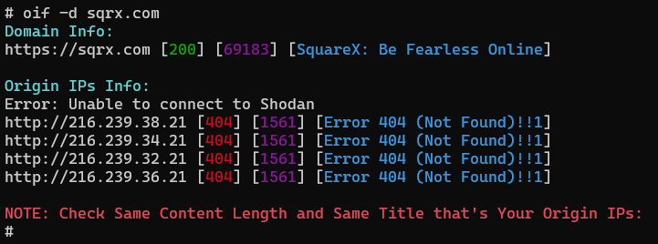

# Origin-IP-Finder

- **Available Search engine support**
  - **[dig](https://phoenixnap.com/kb/linux-dig-command-examples)**
  - **[censys](https://search.censys.io)**
  - **[securitytrails](https://securitytrails.com)**
  - **[viewdns](https://viewdns.info)**
  - **[hunter-how](https://hunter.how)**
  - **[fofa](https://en.fofa.info)**
  - **[zoomeye](https://www.zoomeye.org)**
  - **[zoomeye_without_api](https://www.zoomeye.org)**
  
# Installation
```
git clone https://github.com/Mysteriza/originip.git
cd Origin-IP-Finder
chmod +x oif
mv oif /usr/bin/
```

# Setup

**censys api is `paid` and setup is `optional` but if want good results please setup with...**

```
-c CENSYS_ID:CENSYS_SECRET
```
  
# Usage
  
```
oif -d domain.com
```

```
bash oif -d example.com -c CENSYS_ID:CENSYS_SECRET -s SECURITYTRAILS_API_KEY -h HUNTER_API_KEY -z ZOOMEYE_API_KEY -f email@example.com:fofa_api_key
```

# Output



